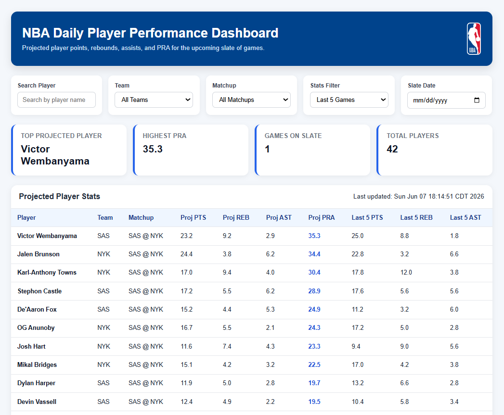

# NBA Player Prediction Model

> An end-to-end data pipeline and web application designed to forecast NBA player performance (Points, Rebounds, Assists) using historical game data and machine learning.

## Overview
Rather than relying on manual spreadsheet tracking, this system automates the entire daily fantasy sports analytical process. It extracts live data from the NBA's official endpoints, cleans and stores it in a relational database, generates predictions using a Lasso regression model, and generates the top value plays through a custom Java web dashboard. 

The model factors in season averages, rolling game trends, rest advantages, and opponent defensive pacing to calculate precise performance projections.

## Tech Stack
* **Data Collection & Engineering:** Python 3, `pandas`, `nba_api`
* **Machine Learning:** `scikit-learn` (LassoCV)
* **Database:** MySQL
* **Backend & API:** Java (JDBC, Servlets, DAO Pattern)
* **Frontend:** JSP (JavaServer Pages), HTML/CSS

---

## Model Accuracy Results

To evaluate the effectiveness of the projections, the model's predictions were tested against a dataset of actual NBA games. Performance is measured using **Mean Absolute Error (MAE)**, which represents the average difference between the predicted stat line and the actual game result, and **Root Mean Squared Error (RMSE)**, which penalizes larger outliers.

### Overall Error Margins
| Stat Category | Mean Absolute Error (MAE) | Root Mean Squared Error (RMSE) |
| :--- | :--- | :--- |
| **Points (PTS)** | 4.59 | 5.98 |
| **Rebounds (REB)** | 1.90 | 2.49 |
| **Assists (AST)** | 1.33 | 1.80 |

---

## Architecture & Data Pipeline

The project follows a robust ETL and Machine Learning architecture:

1.  **Extract:** Python scripts utilize the `nba_api` library to pull massive batches of raw player game logs directly from the NBA's statistical databases.
2.  **Transform:** Raw JSON data is loaded into Pandas DataFrames. Missing data is handled, irrelevant exhibition games are filtered out, and complex rolling averages (e.g., last 5/10 games, days of rest, opponent pacing) are engineered into features.
3.  **Train & Predict:** The processed features are fed into a regularized Lasso Regression model (`LassoCV`). The model identifies the most heavily weighted statistical features and outputs quantitative projections for upcoming matchups.
4.  **Load:** Using Python's MySQL connector, the cleaned game logs, rolling aggregates, and finalized projections are bulk-inserted into a structured MySQL database (`prediction_modeldb`).
5.  **Serve:** A Java backend establishes a JDBC connection to the MySQL database. It executes complex SQL joins, sorts the projections using a custom `MergeSort` algorithm, and serves the daily slate to an interactive web dashboard.

## Key Features
* **Multi-Season Tracking:** Capable of storing and querying thousands of game logs across multiple NBA seasons.
* **Automated Data Cleaning:** Safely handles missing values, DNP (Did Not Play) designations, and data anomalies before database insertion.
* **Dynamic Feature Engineering:** Calculates up-to-date player form, team usage rates, and true shooting efficiency on the fly.
* **Interactive Web Dashboard:** Sorts and displays the top daily fantasy "PRA" (Points + Rebounds + Assists) values for the current slate of games.

---

## Installation & Setup

### Prerequisites
* Python 3
* Java Development Kit (JDK) 11+
* MySQL Server
* Apache Tomcat (or preferred Java web server)

### Database Configuration
* Start your local MySQL server.
* Execute the `database/schema.sql` script to initialize the `prediction_modeldb` tables.

### Running the Pipeline
Run this to grab the updated game logs:

```bash
python load_game_logs.py
```

Run this to retrain the model and produce today's projections:

```bash
python model_training.py
```

### Launching the Dashboard
* Deploy the Java application to your Tomcat server.
* Navigate to `http://localhost:8080/nba_dfs_dashboard` to view the day's top projections



### Future Enhancements
* Automate daily game scraping
* Automate the scraping of daily injury reports to adjust usage rates for remaining active players.
* Migrate the MySQL database and Java backend to AWS (RDS/EC2) for continuous, automated daily cron jobs.
* Train and test the model on common defensive psotional targets
